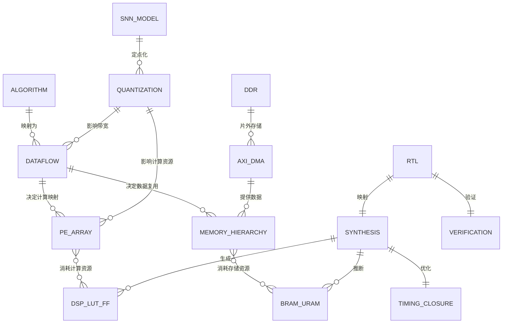
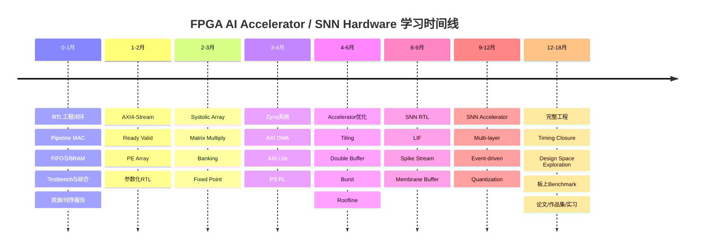

# 面向 FPGA AI Accelerator / SNN 硬件工程师的完整学习计划书

## Executive Summary

基于你目前明确掌握的内容——**Verilog 基本语法、组合逻辑、时序逻辑、寄存器定义、简单 FSM，以及 DMA、FIFO、BRAM、PE、MAC、Systolic Array、Dataflow 的基本概念**——你已经越过了“第一次接触 FPGA”的阶段，但还没有形成“从算法 → RTL → 仿真 → 综合 → 资源映射 → 时序收敛 → AXI/DMA → 板上验证 → 性能优化”的完整工程闭环。按照本报告定义的“FPGA AI Accelerator / SNN 硬件工程师能力树”，你的**概念覆盖度约为 30%–35%，真正可验证的工程闭环完成度约为 15%–20%，综合进度可保守估计在约 25% 左右**；这不是考试分数，而是用于制定学习路线的工程评估。后续最重要的不是继续大量学习 Verilog 语法，而是把你已经知道的 MAC、PE、FIFO、BRAM、DMA 等概念逐级“落到硬件上”：先写可综合、可验证、可分析资源的 RTL 模块，再构建 PE Array 和 Systolic Array，再学习 AXI/DDR/DMA，把片上 Buffer、Banking、定点化、流水线、双缓冲和 Burst Access 组合起来，最后进入真正的 SNN 加速器。这个顺序与经典加速器研究中强调的**数据移动、片上存储、计算阵列和数据流协同设计**是一致的：Eyeriss 将 Row-Stationary 建立在数据复用和存储层次优化上；Google TPU 则同时配置了大型片上 Unified Buffer、Weight FIFO、Accumulator 和 65,536 个 8-bit MAC，而不是单纯堆计算单元。citeturn1search24turn1search13turn3view0

> **本计划默认学习强度：每周约 10–14 小时，以 12 小时/周作为时间预算基准。你的实际可用时间、现有 FPGA 板卡、预算、Vivado 使用经验、Python/C/C++ 水平、SNN 模型熟悉程度均为“未指明”，因此以下计划同时给出无板卡、Zynq-7000 和 Zynq UltraScale+ 三种路线。**

## 优先检索与引用的资料体系

后续学习时，不建议把博客或零散视频当作“知识源”。你的主资料应该形成一个明确的优先级：

> **AMD/Xilinx / Arm 官方文档 → 原始论文 → 经典教材 → 官方教程 → 博客/视频仅作为辅助解释。**

本报告优先依据以下资料构建。AMD 官方文档门户目前提供 UG900、UG901、UG903、UG906、UG908、UG949 等多份文档的简体中文版本，因此英语阅读尚未完全适应时，可以采用“中文先建立概念，英文原文确认术语”的方式。citeturn10search1

| 优先级 | 文献/文档 | 来源类型 | 你主要用它学什么 |
|---|---|---|---|
| A | **AXI DMA Product Guide PG021 v7.1** | AMD 官方 | MM2S、S2MM、DMA、Scatter/Gather、Memory Map ↔ AXI4-Stream。当前 PG021 说明 AXI DMA 用于 memory-mapped memory 与 AXI4-Stream 外设之间的高带宽传输。citeturn0search0turn0search8 |
| A | **Vivado Design Suite: AXI Reference Guide UG1037** | AMD 官方 | AXI4、AXI4-Lite、AXI4-Stream、握手、AXI 系统设计。citeturn0search1 |
| A | **AMBA AXI/ACE Protocol Specification IHI0022** | Arm 官方 | AXI 协议真正的规范定义；需要确认协议行为时以它为准。citeturn8search3turn8search15 |
| A | **Vivado Synthesis UG901，2026.1** | AMD 官方 | RTL 如何综合成门级结构、综合策略、推断资源。citeturn0search2turn0search22 |
| A | **Vivado Logic Simulation UG900，2026.1** | AMD 官方 | Testbench、行为仿真、综合后和实现后仿真。citeturn4search2turn4search10 |
| A | **Vivado Using Constraints UG903，2026.1** | AMD 官方 | Clock/XDC、I/O Delay、False Path、Multicycle Path 等。citeturn9search0turn9search12 |
| A | **Vivado Design Analysis and Closure UG906，2026.1** | AMD 官方 | WNS/TNS、critical path、timing closure、利用率分析。citeturn0search3turn0search7 |
| A | **UltraFast Design Methodology UG949，2026.1** | AMD 官方 | 从 RTL、资源映射到 Timing Closure 的完整工程方法；AMD 将 design closure 定义为同时满足性能、时序、功耗并完成硬件功能验证。citeturn9search5turn9search13 |
| A | **Programming and Debugging UG908，2026.1** | AMD 官方 | Bitstream、ILA、System ILA、板上调试。官方中文文档明确说明 ILA 用于实现后的系统内信号监控与触发。citeturn4search3turn10search2 |
| A | **UltraScale Memory Resources UG573** | AMD 官方 | BRAM/URAM、端口、位宽、Banking 的物理基础。UltraScale Block RAM 每块最高 36 Kbit，并支持不同的双端口组织形式。citeturn4search1turn4search5turn4search17 |
| A | **UltraScale DSP Slice UG579** | AMD 官方 | DSP48E2、乘法器、累加器、Pipeline、Cascade。AMD 明确将 DSP slices 定位为高效实现乘法和累加类 DSP 运算的专用硬件。citeturn4search0turn4search12 |
| A | **Eyeriss: A Spatial Architecture for Energy-Efficient Dataflow** | 经典论文 | PE、Memory Hierarchy、Data Reuse、Row Stationary；RS 的核心目标是减少空间架构中的数据移动。citeturn1search24turn1search0 |
| A | **In-Datacenter Performance Analysis of a Tensor Processing Unit** | Google/ISCA 论文 | Matrix Multiply Unit、Systolic Data Setup、Buffer、Weight FIFO、Accumulator、Bandwidth 与计算阵列的关系。TPUv1 的核心矩阵单元包含 65,536 个 8-bit MAC 和 28 MiB 软件管理片上存储。citeturn1search13turn2view0 |
| B | **Roofline: An Insightful Visual Performance Model** | Berkeley 经典论文 | 判断设计究竟是 Compute-bound 还是 Memory-bandwidth-bound。citeturn13search2 |
| B | **Quantization and Training of Neural Networks for Efficient Integer-Arithmetic-Only Inference** | CVPR 论文 | INT8/定点化的数学基础，整数推理。citeturn5search0turn5search3 |
| B | **FireFly / FireFly v2** | FPGA-SNN 论文 | FPGA SNN 中 DSP、存储、spatiotemporal dataflow 与 spike computation 的具体设计案例。FireFly 特别研究了 DSP48E2 与 SNN 运算、片上权重/膜电位存储之间的协同优化。citeturn12academia27turn12academia30 |
| B | **Spiker+** | FPGA-SNN 论文 | 可配置多层 SNN、神经元硬件结构、FPGA 资源和延迟评价方式。citeturn12search1 |
| B | **Computer Architecture: A Quantitative Approach** | 经典教材 | Memory Hierarchy、Bandwidth、Latency、Parallelism、性能分析。2025 年发布了第七版。citeturn8search0 |
| B | **Digital Design and Computer Architecture** | 经典教材 | 数字逻辑、组合/时序电路、Pipeline、体系结构。citeturn8search1 |
| B | **FPGA Prototyping by Verilog Examples — Pong P. Chu** | FPGA 教材 | 从 RTL 到可综合 FPGA 小系统，强调 learn-by-doing。citeturn8search2turn8search6 |

你的阅读方法不应该是“从头到尾读完所有 PG/UG”。例如 PG021 不是教科书，而是 DMA 设计时查 MM2S/S2MM、寄存器、数据宽度和错误状态的参考手册；UG901/903/906 则应该随着实际综合、约束和 Timing Closure 反复查阅。AMD 自己也将这些不同文档划分到仿真、综合、约束、实现、分析、调试等不同设计阶段。citeturn10search1

## 当前能力树与已完成进度

首先需要纠正一个容易产生错觉的地方：**“知道 PE、DMA、BRAM、Systolic Array 是什么”与“能够设计、综合并优化它们”不是同一个能力等级。**

以 PE 为例：

```text
概念：
PE = Processing Element
        ↓
理解：
PE执行 MAC / neuron operation
        ↓
RTL：
自己设计寄存器、MAC、valid、pipeline
        ↓
资源：
知道为什么用了 DSP / LUT / FF
        ↓
时序：
知道 critical path 在哪里
        ↓
阵列：
PE × N + interconnect
        ↓
系统：
BRAM → PE Array → AXI Stream → DMA
        ↓
架构：
根据带宽/资源决定 PE 数量与 dataflow
```

你目前大体处于**第二层末尾，正在进入第三层**。

| 能力域 | 当前状态 | 判断依据 | 后续目标 |
|---|---|---|---|
| Verilog 基本语法 | **已掌握** | 用户明确提供 | 不再系统重学语法 |
| 组合逻辑 | **已掌握** | 用户明确提供 | 关注综合出来的 LUT/MUX 结构 |
| 时序逻辑 | **已掌握** | 用户明确提供 | 进入 pipeline、enable、reset、latency |
| Register/寄存器定义 | **已掌握** | 用户明确提供 | 理解 FF 数量与 datapath pipeline |
| 简单 FSM | **已掌握** | 用户要求按此假设 | 进入 datapath + controller 的 FSMD |
| Blocking / Non-blocking 的工程规范 | **未指明** | 未明确提供 | 必须熟练 |
| 参数化 module / generate | **未指明** | 未明确提供 | PE Array 必学 |
| 自检 Testbench | **未指明** | 未明确提供 | 高优先级 |
| Assertions / 随机测试 | **未指明** | 未明确提供 | 中期掌握 |
| FIFO 概念 | **已掌握基础概念** | 用户明确提供 | 需要自己实现/验证同步 FIFO |
| FIFO RTL 与 full/empty | **未指明** | 仅说明了解概念 | 短期完成 |
| Async FIFO / CDC | **未指明** | 未提供 | 中期必须掌握 |
| BRAM 概念 | **已掌握基础概念** | 用户明确提供 | 进入 inference、dual-port、banking |
| BRAM RTL inference | **未指明** | 未提供 | 短期完成 |
| DSP48 / DSP 映射 | **未指明** | 未提供 | 短期重点 |
| MAC 概念 | **已掌握基础概念** | 用户明确提供 | 写 parameterized pipelined MAC |
| PE 概念 | **已掌握基础概念** | 用户明确提供 | 工程层面属于**部分掌握** |
| PE Array | **部分掌握** | 知道概念，未开始内部 RTL 连接 | 1–3 月重点 |
| Systolic Array | **部分掌握** | 知道概念，但内部连接/RTL 尚未学 | 2–4 月重点 |
| Dataflow | **部分掌握** | 知道基本意义 | 尚不能做 mapping/tiling |
| DMA 概念 | **已掌握基础概念** | 用户明确提供 | 尚需实际配置 MM2S/S2MM |
| AXI4-Stream | **未指明** | 用户未明确提供 | 必学 |
| AXI4-Lite | **未指明** | 用户未明确提供 | 必学 |
| AXI4 Memory-Mapped | **未指明** | 用户未明确提供 | 需要理解 |
| Ready/Valid Backpressure | **未指明** | 用户未明确提供 | 短期重点 |
| Vivado RTL Simulation | **未指明** | 未提供 | 必须形成常规习惯 |
| Vivado Synthesis | **未指明** | 未提供 | 必须会读报告 |
| Place & Route | **未指明** | 未提供 | 中期必须掌握 |
| XDC | **未指明** | 未提供 | 中期必须掌握 |
| Setup/Hold/WNS/TNS | **未指明** | 未提供 | 核心工程能力 |
| Timing Closure | **未指明** | 未提供 | 3–12 月持续训练 |
| CDC | **未指明** | 未提供 | FPGA 岗位重要内容 |
| ILA/System ILA | **未指明** | 未提供 | 有板卡后必做 |
| 定点数 Q-format | **未指明** | 未提供 | AI/SNN 必学 |
| 神经网络量化 | **未指明** | 未提供 | AI Accelerator 必学 |
| Tiling | **未指明** | 未提供 | 中期重点 |
| Double Buffer | **概念可能接触过，但未确认** | 当前信息不足 | 归为未指明 |
| Memory Banking | **未指明** | 未提供 | 中期重点 |
| Burst Access | **未指明** | 未提供 | AXI/DDR 优化重点 |
| Roofline/带宽建模 | **未指明** | 未提供 | 架构设计重点 |
| LIF 硬件 RTL | **未指明** | SNN经历未作为当前假设 | 中长期核心 |
| Event-driven SNN | **未指明** | 未提供 | SNN specialization |
| Python Golden Model | **未指明** | 未提供 | 强烈建议掌握 |
| C/C++ PS 端控制 | **未指明** | 未提供 | Zynq 系统需要 |
| Git/Tcl 自动化 | **未指明** | 未提供 | 工程化补齐 |
| 当前 FPGA 板型号 | **未指明** | 用户未提供 | 见后文多方案 |

为了避免“会几个名词就认为已经完成一半”，本计划采用下面的权重模型。它是**路线规划模型，不是行业认证标准**：

| 能力块 | 总权重 | 目前估计完成 |
|---|---:|---:|
| 数字逻辑 + Verilog RTL 基础 | 15% | 约 12% |
| RTL 模块化、Pipeline、FIFO、RAM | 12% | 约 3% |
| 仿真与 Verification | 10% | 未指明，暂不计 |
| FPGA 资源映射 | 10% | 约 2% |
| Timing / Constraints / CDC | 10% | 未指明，暂不计 |
| AXI / DMA / PS-PL 系统 | 12% | 约 3% |
| AI Accelerator Architecture | 13% | 约 4% |
| Fixed-point / Quantization | 7% | 未指明 |
| SNN 硬件 specialization | 7% | 未指明 |
| 性能优化、板上验证与工程交付 | 4% | 未指明 |

因此：

\[
Progress \approx 24\%
\]

考虑到“未指明”中你可能实际上已经掌握一部分，合理区间大约是：

\[
\boxed{20\%-30\%}
\]

也就是说，你**不是 FPGA 零基础，大约完成了进入正式 RTL/Accelerator 工程学习之前的四分之一**。

真正的转折点不是再多认识几个名词，而是达到：

> **看到一段 RTL → 能预测主要资源 → 综合验证 → 看 Utilization → 看 Timing → 修改架构 → 重新综合。**

Vivado 本身就是按照这一闭环工作的：RTL 经过 synthesis 转为 gate-level representation，而 implementation/analysis 阶段需要继续检查资源、时钟、约束和 timing closure。citeturn0search22turn0search3turn9search13

## 能力关系与总体时间线

你之前说“FPGA 中更重要的是资源的整合”，这个方向是正确的，但可以进一步精确定义：

> **FPGA 工程能力 = 用 RTL 表达一个架构，并让 LUT、FF、BRAM、DSP、片外带宽、时钟和数据流共同达到功能与性能目标。**

这也正是为什么仅学习 Verilog 语法不够。Eyeriss 的架构重点之一是通过数据流、片上 memory hierarchy 和 PE spatial array 降低数据移动；TPU 的芯片面积也不只是 Matrix Multiply Unit，其 block diagram 同时包括 Unified Buffer、Weight FIFO、Accumulator、DDR 接口与控制系统。citeturn1search24turn3view0



你最终需要能够独立回答：

```text
为什么用 16 个 PE 而不是 32 个？
          ↓
DSP够不够？

为什么 Buffer 用 8 个 Bank？
          ↓
PE每周期需要多少个读端口？

为什么用 INT8？
          ↓
DSP / BRAM / DDR bandwidth 怎么变化？

为什么加 Pipeline？
          ↓
critical path 怎么变化？

为什么 Double Buffer？
          ↓
DMA和Compute能不能重叠？

为什么性能没有达到理论 GMAC/s？
          ↓
PE利用率？DDR？AXI？BRAM conflict？stall？
```

而不是只回答：

```text
PE是什么？
FIFO是什么？
DMA是什么？
```

整个 18 个月建议按照下面的顺序走：



**时间预算建议：**

| 学习强度 | 每周 | 18 个月累计约 | 适用情况 |
|---|---:|---:|---|
| 低强度 | 6–8 h | 约 470–620 h | 同时课程/科研非常重 |
| **标准路线** | **10–14 h** | **约 780–1090 h** | **本报告默认** |
| 高强度 | 18–24 h | 约 1400–1870 h | 明确转 FPGA/RTL 求职 |

这里真正重要的不是“18 个月必须全部学完”，而是**每一个阶段都留下可以运行和复现的工程交付物**。

## 分阶段完整学习计划

**短期：0–1 月——从“会 Verilog”变成“会做 RTL 模块”**

这一阶段暂时**不要继续深挖大型 Systolic Array 论文**。你需要先建立 RTL 的最小工程闭环：

\[
Specification
\rightarrow RTL
\rightarrow Testbench
\rightarrow Simulation
\rightarrow Synthesis
\rightarrow Utilization
\rightarrow Timing
\]

AMD 官方仿真文档把 simulation 定义为通过 stimulus 和输出观察来验证设计行为，并支持 RTL behavioral simulation、post-synthesis 和 post-implementation simulation；Vivado 综合则负责将 RTL 转换成 gate-level representation。citeturn4search10turn4search2turn0search22

| 项目 | 本阶段要求 |
|---|---|
| 学习目标 | 独立设计、仿真、综合一个中等复杂度 datapath |
| RTL | parameter、generate、signed arithmetic、width growth、blocking/non-blocking |
| Pipeline | latency、throughput、valid pipeline |
| FSM | FSM + datapath，即 FSMD |
| Verification | self-checking TB、corner cases、random stimulus |
| Memory | synchronous RAM、simple dual-port RAM、FIFO |
| Resource | LUT/FF/BRAM/DSP 分别是什么以及代码如何映射 |
| Timing | create_clock、critical path、WNS 初步 |
| 工具 | Vivado / xsim |
| 时间 | 约 45–60 小时 |

**这个月必须写的模块：**

```text
mac.sv / mac.v
fifo_sync.sv
bram_buffer.sv
stream_pipeline.sv
pe.sv
pe_array.sv
```

先实现：

\[
acc_{t+1}=acc_t+a_tb_t
\]

再实现：

```text
input
 ↓
register
 ↓
multiply
 ↓
register
 ↓
accumulate
 ↓
register
```

然后比较：

```text
无pipeline
vs
1级pipeline
vs
2/3级pipeline
```

记录：

```text
LUT
FF
DSP
Fmax
Latency
Throughput
```

这是你第一次真正理解：

> **Register 不只是“保存变量”，而是 FPGA 时序架构的一部分。**

AMD 的 DSP48E2 资料也明确说明 FPGA 内部提供专门面向乘法和累加类运算的 DSP 资源，因此你应该通过综合报告确认 MAC 是否被映射到 DSP，而不是凭 RTL 代码猜。citeturn4search12turn4search0

**月末量化验收目标：**

- ≥ **6 个自己写的可综合 RTL module**
- ≥ **6 个 self-checking Testbench**
- 所有测试累计至少 **10⁴–10⁵ 组 stimulus**
- 无 unintended latch
- 无多驱动
- MAC 在目标器件允许的位宽条件下能够观察到合理 DSP inference
- RAM 版本至少有一个能够推断 BRAM，而不是全部用 FF
- 在你选择的目标器件上先设置 **100 MHz 工程目标**，要求 `WNS ≥ 0`；这是本计划的人为训练目标，不是所有 FPGA 的性能标准
- README 能解释 latency、throughput、资源占用

**近中期：1–6 月——进入真正 FPGA Accelerator**

这五个月是整个计划最关键的阶段。

你要把：

```text
MAC
 ↓
PE
 ↓
PE Array
 ↓
Systolic / Vector Engine
 ↓
Buffer
 ↓
AXI Stream
 ↓
DMA
 ↓
DDR
```

真正连起来。

AXI DMA 官方 PG021 将 DMA 定义为 memory-mapped memory 与 AXI4-Stream 类型外设间的数据通道，并提供 MM2S 和反方向传输等能力；因此 DMA + AXI Stream + 自定义 Accelerator 是非常合适的训练系统。citeturn0search0turn0search28turn0search32

**1–2 月：Stream RTL + PE Array**

必学：

```text
valid / ready
backpressure
FIFO
pipeline
parameterized PE
generate
vector dot product
```

重点规则：

\[
transfer = valid \land ready
\]

你的模块不能只有：

```text
data_in
data_out
```

而应逐步设计成：

```text
s_valid
s_ready
s_data

m_valid
m_ready
m_data
```

AMD 自定义 IP 文档中的 AXI4-Stream 信号包括 `TDATA/TVALID/TREADY/TKEEP/TLAST/...`，这些接口会贯穿后面的 DMA 系统。citeturn0search17

目标：

```text
FIFO
 ↓
8 PE
 ↓
Reduction Tree
 ↓
Output
```

实现：

\[
y=\sum_{i=0}^{7}x_i w_i
\]

如果每个 PE 每周期执行一个 MAC：

\[
Peak\ MAC/s =
N_{PE}\times f_{clk}
\]

例如：

\[
8\times100MHz
=
0.8\ GMAC/s
\]

如果论文把 multiply 与 add 分别计为一个 operation，则相当于理论：

\[
1.6\ GOPS
\]

因此以后写性能报告必须明确：

> **你统计的是 MAC/s 还是 OPS/s。**

**2–3 月：4×4 Systolic Matrix Multiplier**

现在再正式研究 PE 内部连接。

项目：

```text
A matrix →
          PE PE PE PE
          PE PE PE PE
          PE PE PE PE
          PE PE PE PE
                    ↓
                 C matrix
```

目标：

- 16 PE
- 参数化 bit width
- 参数化 matrix size
- pipeline
- skew input
- accumulator
- valid schedule

Google TPU 的 Matrix Multiply Unit 正是用大规模 MAC 阵列完成矩阵/卷积计算，并通过 Unified Buffer 和 Weight FIFO 向阵列供数；TPUv1 的论文同时显示其矩阵单元、Weight FIFO、Accumulator 和片上 buffer 的物理关系。citeturn2view0turn3view0

这一阶段不要追求 TPU 规模。

你的目标是：

> **真正搞懂 4×4。**

做到能逐周期画出：

```text
cycle 0
cycle 1
cycle 2
...
```

每个 PE 里面有哪些：

```text
a_reg
b_reg
psum_reg
valid_reg
```

**3–4 月：AXI + DMA + Zynq**

开始系统工程：

```text
                  AXI-Lite
CPU ------------------------------→ Accelerator control
                                      |
DDR → AXI DMA → AXI4-Stream → Accelerator
                                      |
DDR ← AXI DMA ← AXI4-Stream ←--------+
```

必学：

- AXI4-Lite：寄存器控制
- AXI4-Stream：数据流
- AXI4 Memory Mapped：DDR 一侧
- DMA MM2S
- DMA S2MM
- TLAST
- TKEEP
- interrupt 基础
- cache consistency 基础
- PS/PL
- Block Design
- Custom IP packaging

Vivado 的 Custom IP 文档支持把当前 RTL 工程封装成 IP，并处理接口、文件和器件兼容信息。citeturn9search2turn9search30

此阶段你必须第一次完成：

```text
PC/Python/C
   ↓
ARM PS
   ↓
DDR
   ↓
DMA
   ↓
你的RTL Accelerator
   ↓
DMA
   ↓
DDR
```

**4–6 月：从“能跑”变成“像 Accelerator”**

开始真正学习：

```text
Tiling
Banking
Double Buffer
Burst
Data Reuse
Fixed Point
Quantization
Roofline
PE Utilization
Bandwidth Utilization
```

Roofline 模型把 attainable performance 与**峰值计算能力、memory bandwidth 和 operational intensity**联系起来，非常适合训练“为什么增加 PE 后性能不再增长”的分析思维。citeturn13search2

此时把一个大矩阵切成：

\[
A_{tile}\times B_{tile}
\]

而不是让 PE 每次都访问 DDR。

结构：

```text
DDR
 ↓ burst
Buffer A0 ───┐
             ├→ PE Array
Buffer A1 ───┘

DMA加载 A1
     +
PE计算 A0

同时执行
```

TPUv1 的矩阵单元内部就使用了权重 tile 的 double buffering 来隐藏加载过程，这是双缓冲在实际 AI accelerator 中的经典例子。citeturn3view0

六个月结束，你应该有一个真正能放进简历的：

> **Parameterized INT8 Matrix-Multiply Accelerator on FPGA with AXI DMA and On-Chip Double-Buffered Memory**

而不是“完成过流水灯/UART”。

**六个月量化目标：**

| 指标 | 目标 |
|---|---:|
| 可复用 RTL module | ≥ 10–15 个 |
| Self-checking TB | ≥ 10 个 |
| PE Array | ≥ 8 PE |
| Systolic Array | ≥ 4×4 |
| AXI4-Stream Accelerator | 1 套 |
| AXI4-Lite Control | 1 套 |
| DMA end-to-end | 1 套 |
| BRAM banking | ≥ 1 个实现 |
| Double buffer | ≥ 1 个实现 |
| Fixed-point version | ≥ 2 种 bit-width |
| Target clock | Zynq-7000 先以 100–150 MHz 作为个人工程目标；实际值以器件、位宽和 routing 为准 |
| Timing | WNS ≥ 0 |
| PE steady-state utilization | 自建 benchmark 下争取 ≥85% |
| DMA large-block utilization | 争取达到配置 stream-side 理论带宽的 ≥60%，未达到时必须解释原因 |
| Performance report | GMAC/s + latency + bandwidth + resource table |

例如 16 个单 MAC PE 在 100 MHz：

\[
16\times100M=1.6\ GMAC/s
\]

如果 AXI Stream 是 32 bit @ 100 MHz：

\[
BW_{peak}=4B\times100M
=400MB/s
\]

64 bit 则：

\[
800MB/s
\]

你从这一步开始就应该经常问：

\[
\frac{\text{Compute demand}}
{\text{Memory bandwidth}}
\]

而不是只看 DSP 个数。

**中长期：6–18 月——从通用 Accelerator 转向 SNN Hardware**

这时候才应该把你的重点明显切到 SNN。

原因是 SNN Accelerator 仍然依赖前面所有能力：

```text
SNN
不是跳过FPGA基础

而是：

RTL
+
Buffer
+
Dataflow
+
PE
+
Memory
+
Quantization
+
AXI
+
Sparsity
+
Temporal State
```

FireFly 的工作之所以值得你在这一阶段读，就是因为它不是单纯讨论 LIF 数学模型，而是同时讨论 SNN arithmetic、DSP48E2、weights、membrane voltage memory 和片上资源；FireFly v2 又进一步研究 spatiotemporal dataflow 和 systolic backend。citeturn12academia27turn12academia30

**6–9 月：LIF Hardware Core**

实现：

\[
V[t]
=
\beta V[t-1]
+
I[t]
\]

然后：

\[
S[t]
=
\begin{cases}
1 & V[t]\ge V_{th}\\
0 & \text{otherwise}
\end{cases}
\]

以及 reset：

```text
spike
 ↓
reset membrane
```

必做不同实现：

```text
版本A：float/reference software

版本B：Q-format fixed point

版本C：shift-friendly leak
```

你的 RTL：

```text
lif_neuron.sv
synapse_accumulator.sv
spike_fifo.sv
membrane_bram.sv
neuron_controller.sv
```

神经网络量化文献已经证明整数算术推理可以通过量化方案构建，而 AMD 的 fixed-point 设计材料也专门讨论固定点设计与资源/精度之间的权衡。citeturn5search0turn5search1

**9–12 月：SNN Layer Accelerator**

从一个 neuron 变成：

```text
Spike stream
    ↓
Synapse Engine
    ↓
Weight Buffer
    ↓
Accumulation
    ↓
LIF Array
    ↓
Spike FIFO
```

这时必须比较两个架构：

```text
Spatial parallel

很多neurons同时算
```

和：

```text
Time multiplex

少量hardware
重复计算很多neurons
```

前者：

```text
速度 ↑
资源 ↑
```

后者：

```text
速度 ↓
资源 ↓
```

这种 resource-time trade-off 正是 FPGA 架构能力，而不是 Verilog 语法能力。

Spiker+ 是非常适合这个阶段的参考，因为它提供可配置多层 FPGA SNN 架构及神经元实现，并以逻辑资源、BRAM、功耗和 inference latency 等维度报告结果。citeturn12search1

**12–18 月：完整 SNN Accelerator / 科研级项目**

最终系统：

```text
             ARM PS
               |
          AXI-Lite Config
               |
               ↓
DDR → DMA → Input FIFO
               |
               ↓
          Spike Buffer
               |
               ↓
        Synapse Engine
               |
        Weight Buffer
               |
               ↓
          PE / MAC Array
               |
               ↓
           LIF Array
               |
               ↓
       Membrane Buffer
               |
               ↓
          Spike FIFO
               |
              DMA
               |
              DDR
```

此阶段加入：

- Event-driven scheduling
- Spike sparsity exploitation
- neuron state management
- weight compression（可选）
- structured sparsity（进阶）
- multi-timestep pipeline
- layer fusion（进阶）
- resource-aware mapping
- design space exploration

近期 FPGA SNN 工作仍然在研究 event-driven、structured sparsity、不同并行方式以及资源/带宽之间的权衡，例如 2025 年的 event-driven DVS SNN accelerator 和 FireFly 系列都体现了这一方向。citeturn12search2turn12academia27

**18 月终点不应该定义成“看完多少课”，而应该定义成：**

> 你能够拿一个 SNN 网络，分析计算量和存储量，确定数值位宽和 dataflow，设计 PE/Neuron Core/Buffer，估算 DDR 带宽，写 RTL，完成 Testbench、AXI/DMA 集成、综合、实现、Timing Closure、板上验证，然后输出一套可复现实验结果。

## 必做实践任务、验收标准与交付物

下面这套任务建议直接作为你的 Git 仓库项目树。**至少完成前十个，第十一和第十二个成为你的主项目。**

| 实践任务 | 核心内容 | 定量验收标准 | 必须提交的交付物 |
|---|---|---|---|
| **P1 Pipelined MAC** | signed INT8/INT16 MAC、acc、valid | ≥10⁴ 随机向量正确；100 MHz WNS≥0；记录 DSP/LUT/FF | RTL、TB、waveform、utilization、timing、README |
| **P2 Sync FIFO** | wr/rd pointer、full/empty、count | random push/pop ≥10⁵ cycles，0 mismatch；覆盖 full/empty | RTL、TB、波形、corner-case 文档 |
| **P3 BRAM Buffer** | synchronous RAM、simple/true dual-port | 综合报告确认 RAM 进入 BRAM；与 register-array 版本比较资源 | RTL、TB、utilization 对比表 |
| **P4 Ready/Valid Pipeline** | backpressure、stall、latency | random ready ≥10⁵ cycles；无丢数据/重复数据 | RTL、TB、波形、protocol notes |
| **P5 Vector PE Array** | 4/8/16 PE、generate | 8 PE @100MHz 理论 ≥0.8 GMAC/s；steady-state PE utilization ≥85% | RTL、TB、resource scaling plot/table |
| **P6 4×4 Systolic GEMM** | data skew、psum、pipeline | 与 Python/NumPy golden 对至少 1000 matrices 全匹配 | RTL、TB、cycle diagram、Fmax、DSP 表 |
| **P7 Banked BRAM** | 2/4/8 banks、address mapping | 在目标 PE bandwidth 下消除指定 port conflict；报告 bank-conflict rate | RTL、TB、mapping document |
| **P8 Fixed-point Accelerator** | INT16 → INT8 → 自定义 Q format | 软件 golden 对比；报告 accuracy/error 与 LUT/DSP/BRAM 差异 | Python model、RTL、误差图、资源表 |
| **P9 AXI4-Stream Wrapper** | TVALID/TREADY/TLAST | 随机 backpressure 全通过；连续 packet 0 error | RTL/IP、TB、protocol waveform |
| **P10 AXI DMA System** | MM2S + S2MM + DDR | 10 MB 级连续数据无错误；测 sustained MB/s；大型块目标 ≥60% stream-side peak | Vivado BD、PS code/Python、ILA、BW 表 |
| **P11 Double-buffered Tiled GEMM** | ping-pong buffer + compute/load overlap | 相同 workload 下对比 single buffer；明确 DMA stall cycles 下降量；目标 ≥30%（若原系统确为 transfer-bound） | RTL、scheduler、cycle timeline、性能报告 |
| **P12 SNN LIF Accelerator** | synapse + LIF + membrane buffer | 与 Python golden 在所有 test timestep 对齐；测 neurons/s 或 synaptic ops/s | RTL、TB、Python、资源/Fmax/accuracy |
| **P13 Multi-layer SNN** | layer scheduling + spikes | 至少一个公开数据集或你已有模型端到端推理；软件/FPGA结果一致到定义容差 | 完整 repo、model、bitstream、demo |
| **P14 SNN Architecture Optimization** | event-driven / time-multiplex / spatial 比较 | 至少 3 个 architecture points；绘制性能-资源 Pareto | DSE 表、论文式结果表、技术报告 |

其中 P1–P4 是你的**工程基础门槛**。

P5–P8 是：

> **Accelerator 入门门槛。**

P9–P11 是：

> **FPGA 系统工程门槛。**

P12–P14 才是：

> **SNN Hardware specialization。**

每个项目统一采用下面的目录：

```text
project_name/
│
├── rtl/
│   ├── xxx.sv
│   └── ...
│
├── tb/
│   ├── tb_xxx.sv
│   └── vectors/
│
├── python/
│   └── golden_model.py
│
├── constraints/
│   └── top.xdc
│
├── reports/
│   ├── utilization.txt
│   ├── timing.txt
│   └── power.txt
│
├── waveform/
│
├── block_diagram/
│
├── scripts/
│   └── build.tcl
│
└── README.md
```

你的 README **必须回答八个问题**：

| 问题 | 示例 |
|---|---|
| 算什么？ | INT8 GEMM |
| 架构是什么？ | 4×4 systolic |
| 输入输出协议？ | AXI4-Stream |
| 数据在哪里？ | DDR → BRAM → PE |
| 并行度？ | 16 PE |
| Fmax？ | 例如 125 MHz |
| 资源？ | LUT/FF/BRAM/DSP |
| 性能瓶颈？ | compute / BRAM port / AXI / DDR |

到了这一阶段，不建议再把：

```text
代码跑通
```

当作完成。

必须是：

```text
Functional Correctness
+
Simulation
+
Synthesis
+
Timing
+
Resource
+
Performance
+
Documentation
```

AMD 的设计方法也明确把最终 design closure 建立在性能、时序、功耗和硬件功能验证的共同满足上。citeturn9search13

**板卡与工具建议**

你的现有板卡与预算目前是**未指明**，所以分三级考虑：

| 方案 | 建议 | 优势 | 局限 | 适合阶段 |
|---|---|---|---|---|
| **零/低硬件预算** | 先纯 Vivado/xsim，不买板 | P1–P9 大部分 RTL 都能学 | 无 DDR/DMA 真正板上测试 | 0–2 月 |
| **中预算，最推荐学习路线** | Zynq-7020 类：Arty Z7-20 / Zybo Z7-20 / PYNQ-Z2 等 | ARM PS + PL + DDR，非常适合 DMA + Accelerator | 资源较有限，反而能逼你学优化 | 1–12 月 |
| **已有 ZedBoard** | 可以继续使用 | Zynq-7000 系统学习完全够 | Avnet 当前已标记 ZedBoard 为停止生产，不建议专门为了新项目高价购买。citeturn6search17 | 1–12 月 |
| **较高预算/长期 SNN** | **Kria KV260** | Zynq UltraScale+ MPSoC，适合更大的 accelerator、Linux、DDR 系统 | 工具链和平台复杂度更高 | 4–18 月 |

Arty Z7 和 Zybo Z7 都是 Zynq-7000 平台，适合同时学习 processor system 与 programmable logic。citeturn6search3turn6search9 KV260 使用 Zynq UltraScale+ MPSoC；AMD 当前将其作为 Vision AI Starter Kit 提供，官方页面截至目前给出的 MSRP 为 249 美元，实际地区价格和供货需要另行确认。citeturn7search0turn7search1

**对你而言，没有必要第一天就购买更贵的板。**如果当前已经有任何 Zynq-7000 板，优先用现有板。你的前六个月真正的能力瓶颈不会是 FPGA 不够大，而更可能是 RTL、verification、memory architecture、AXI 和 timing。

## FPGA 资源整合与优化方法

这一部分其实是你整个学习计划中**最值得长期训练的能力**。

FPGA Accelerator 不应该这样思考：

```text
我需要算得快
     ↓
多放PE
```

而应该这样：

```text
算法
 ↓
需要多少 MAC？
 ↓
需要多少数据/clock？
 ↓
BRAM有几个端口？
 ↓
需要多少bank？
 ↓
DDR bandwidth够不够？
 ↓
需要多少PE？
 ↓
DSP够不够？
 ↓
Routing还能不能过？
 ↓
Fmax能不能达到？
```

这就是 Architecture Design。

**资源关系可以记成：**

| 资源 | 主要用途 | 常见瓶颈 | 常见解决方法 |
|---|---|---|---|
| LUT | 控制、MUX、小逻辑、地址、特殊 arithmetic | routing / combinational path | pipeline、减少大 MUX、结构重构 |
| FF | pipeline、state、register | FF 数量/控制集/routing | pipeline placement、减少无意义 register |
| DSP | multiply/MAC | DSP 数量/Fmax | quantization、resource sharing、cascade |
| BRAM | weight/activation/FIFO/buffer | 容量和**端口数** | banking、tiling、double buffer |
| URAM | 大片上 buffer | 器件限制/latency | 大 tile / weight storage |
| DDR | 大模型、大 tensor | bandwidth/latency | burst、reuse、tiling、compression |
| AXI | 数据移动 | backpressure/burst efficiency | wider bus、larger burst、overlap |
| Clock | throughput | critical path/routing | pipeline、floorplan、architecture change |

UltraScale BRAM 并不是“无限端口 RAM”；官方文档规定了具体端口结构和位宽配置，因此当 16 个 PE 同时需要很多 operand 时，真正的问题通常不是 BRAM 总容量够不够，而是**每周期能提供多少独立数据**。这正是 Memory Banking 出现的原因。citeturn4search5turn4search17

例如：

```text
1 BRAM
 |
 +→ PE0
 +→ PE1
 +→ PE2
 +→ PE3
 +→ PE4
 +→ PE5
 +→ PE6
 +→ PE7
```

并不意味着能够无代价地：

```text
同一周期8次独立read
```

于是变成：

```text
Bank0 → PE0/1
Bank1 → PE2/3
Bank2 → PE4/5
Bank3 → PE6/7
```

这就是：

> **Banking 是用空间组织换 memory parallelism。**

**流水线 Pipeline**

目标不是单纯“让一个结果更快出来”。

而是缩短 combinational critical path：

```text
MUL + ADD + COMPARE
```

变成：

```text
MUL
 |
Reg
 |
ADD
 |
Reg
 |
COMPARE
```

通常：

```text
Latency ↑
Fmax ↑
Throughput ↑
```

后续看 Timing Report 时你应该从：

```text
WNS = -2.3 ns
```

出发追：

```text
startpoint
endpoint
logic delay
routing delay
```

而不是立刻盲目换综合 strategy。AMD 的 UG906 专门提供 timing、clock tree、utilization 和 design analysis 流程，UG949 则强调先识别最差路径和结构问题，再考虑 floorplanning 等措施。citeturn0search3turn9search17

**Resource Sharing**

例如四个乘法：

空间展开：

```text
4 × DSP
1 cycle
```

时分复用：

```text
1 × DSP
4 cycles
```

就是：

\[
Area \leftrightarrow Throughput
\]

的交换。

所以 FPGA Accelerator 的“资源利用率高”并不是越接近 100% 越好。

你的目标应该是：

> **在满足性能的情况下使用合理资源，并留下 routing/timing/系统 IP 的空间。**

作为训练目标，可以专门设计两个版本：

```text
A：compute-rich
DSP约40%-70%

B：resource-saving
DSP显著减少
```

然后比较：

\[
GMAC/s/DSP
\]

而不是只有：

\[
GMAC/s
\]

**Fixed Point / Quantization**

这不仅仅是模型压缩。

位宽从：

```text
FP32
 ↓
INT16
 ↓
INT8
```

会同时影响：

```text
DDR bandwidth
BRAM capacity
DSP mapping
PE parallelism
routing
power
```

整数推理量化研究的核心就是用较窄整数算术替代高成本浮点推理，同时通过适当的训练/量化方法控制精度损失。citeturn5search0turn5search3

因此你的实验必须输出：

| Bit width | Accuracy/Error | LUT | FF | DSP | BRAM | Fmax | Throughput |
|---|---:|---:|---:|---:|---:|---:|---:|
| FP/高精度 baseline | | | | | | | |
| INT16 | | | | | | | |
| INT8 | | | | | | | |
| custom Q | | | | | | | |

这张表本身就已经是一个很好的 FPGA AI 作品集材料。

**Double Buffer**

错误：

```text
DMA load
   ↓
PE compute
   ↓
DMA load
   ↓
PE compute
```

如果：

\[
T_{load}=100
\]

\[
T_{compute}=120
\]

那么顺序运行：

\[
T=220
\]

理想双缓冲重叠后 steady-state 更接近：

\[
T\approx \max(T_{load},T_{compute})
\]

而不是两者之和。

结构：

```text
        ┌→ Buffer A → Compute
DDR/DMA |
        └→ Buffer B ← Load next tile
```

TPUv1 论文中的 Matrix Unit 就明确描述了使用双 tile 来支持 double buffering，使 compiler 能在 peak performance 场景中隐藏加载时间。citeturn3view0

**Burst Access**

DDR 喜欢大块连续访问。

所以：

```text
一次读一个word
```

通常不是 Accelerator 应追求的数据模式。

应该尽量：

```text
DDR
 ↓
large contiguous transfer
 ↓
AXI burst
 ↓
BRAM tile
 ↓
大量reuse
```

AXI DMA 正是为 memory mapped 与 AXI Stream 之间的大吞吐数据移动设计的，因此到系统优化阶段应重点测量实际 sustained bandwidth，而不是只读协议定义。citeturn0search0

**最终优化判断流程**

以后每次 Accelerator 性能不够，不要第一反应：

> 加 PE。

而按照：

```text
Performance low
      ↓
PE utilization低？
   ↓ yes
为什么stall？
      ↓
BRAM conflict？
AXI backpressure？
DMA？
DDR？
controller bubble？
      ↓
解决数据供应
```

如果 PE utilization 已经很高：

```text
PE utilization ≈ 95%
        ↓
compute-bound
        ↓
增加PE / Fmax / 每PE并行度
```

如果：

```text
PE utilization = 30%
```

再增加 PE：

```text
16 PE → 64 PE
```

通常只会增加资源，性能未必增长。

这就是 Roofline 思维：性能上界同时受**计算峰值和数据供给能力**约束。citeturn13search2

## 实习面试、作品集与最终里程碑

到了实习准备阶段，你需要把“Verilog 面试”和“Accelerator 面试”分开准备。

**RTL 基础必须能不查资料解释：**

```text
blocking vs non-blocking
为什么组合逻辑会推断latch
同步reset vs 异步reset
signed/unsigned
位宽扩展
overflow
parameter/generate
FSM
pipeline
latency vs throughput
```

**FIFO / CDC 必须能解释：**

```text
为什么需要FIFO？
full/empty怎么判断？
同步FIFO vs 异步FIFO？
metastability是什么？
2-FF synchronizer什么时候可以用？
为什么多bit bus不能简单每bit 2FF？
为什么async FIFO pointer常用Gray code？
```

AMD 官方提供了 XPM CDC 单 bit synchronizer，以及 Gray-code 跨时钟域宏；官方资料也强调同步器级数会影响 MTBF、面积和 crossing latency。citeturn9search3turn9search7turn9search39

**Timing 必须能回答：**

```text
setup是什么？
hold是什么？
critical path是什么？
WNS是什么？
TNS是什么？
为什么pipeline能提高Fmax？
false path是什么？
multicycle path是什么？
为什么不能为了过timing随便加false_path？
```

AMD 的约束和 UltraFast 方法文档专门警告 multicycle path 和 timing exceptions 如果定义错误会产生错误约束甚至不可能满足的 hold requirement。citeturn9search12turn9search21

**资源必须能回答：**

```text
LUT是什么？
FF是什么？
BRAM是什么？
DSP是什么？
为什么a*b可能进DSP？
为什么buffer可能进BRAM？
为什么一个很大的register array不是好buffer？
BRAM端口不足怎么办？
banking是什么？
为什么资源利用100%不一定好？
```

**AXI/DMA 必须能回答：**

```text
AXI4
AXI4-Lite
AXI4-Stream

三者区别？

TVALID/TREADY什么时候发生transaction？

TLAST是什么？

DMA是什么？

MM2S是什么？

S2MM是什么？

为什么需要DMA而不是CPU memcpy？

Burst为什么重要？
```

AXI DMA 的 MM2S control register 即负责 Memory Map to Stream channel，而 PG021 对 MM2S/S2MM、direct register 和 scatter/gather 等模式进行了正式定义。citeturn0search28turn0search8

**AI Accelerator 必须能回答：**

```text
为什么需要PE Array？
为什么需要片上Buffer？
为什么不能DDR直接每次给PE？
Data reuse是什么？
Systolic Array解决什么问题？
Weight Stationary是什么？
Output Stationary是什么？
Row Stationary是什么？
Tiling是什么？
Double Buffer是什么？
Compute-bound vs Bandwidth-bound？
```

Eyeriss 是这些问题最重要的原始参考之一，因为 Row-Stationary 正是针对 convolution dataflow 中的数据复用与数据移动成本而提出。citeturn1search24

**SNN 岗位再增加：**

```text
LIF equation怎么硬件实现？
膜电位存在哪里？
一个神经元对应一个physical neuron还是time-multiplex？
Spike为什么可以只用1bit？
权重怎么办？
timestep怎么调度？
event-driven和clock-driven有什么区别？
spike sparsity怎么利用？
膜电位state怎么管理？
fixed-point误差怎么分析？
```

FireFly、FireFly v2 和 Spiker+ 可以作为这一组问题的论文级参考，而不是依赖二手博客。citeturn12academia27turn12academia30turn12search1

**你的项目展示千万不要只说：**

> 我使用 Verilog 实现了一个 SNN Accelerator。

这基本没有工程信息。

应该说：

> “设计了一个参数化 INT8/SNN inference accelerator，采用 N 个并行 processing elements、banked BRAM weight buffer 和 double-buffered input tiles；数据通过 AXI DMA 从 DDR 输入，控制使用 AXI4-Lite。设计在某 FPGA 上实现于 X MHz，使用 X LUT、X FF、X BRAM、X DSP，达到 X GMAC/s / X synaptic ops/s；通过 Python golden model 和 self-checking RTL testbench 验证，随后通过 ILA 完成板上数据路径调试。瓶颈分析表明原设计受 BRAM port / DDR bandwidth / critical path 限制，经过某优化后吞吐提升 X%。”  

这才是 FPGA/Accelerator 工程表达。

板上调试时，ILA/System ILA 应成为证据链的一部分。AMD 官方说明 ILA 可在实现后的 FPGA/SoC 中以系统速度监控内部信号，而 System ILA 还能监控 AXI4-MM 和 AXI4-Stream 接口；同时 ILA probe width 和 capture depth 会消耗额外资源并可能影响 timing，因此调试 IP 也必须作为资源的一部分管理。citeturn10search2turn10search10turn4search7

**最终作品集建议至少有三个层次：**

| 项目 | 证明什么 |
|---|---|
| **RTL Fundamentals Repository** | 证明 FIFO、MAC、RAM、Pipeline、CDC、Verification 基础 |
| **AXI DMA Matrix Accelerator** | 证明 PS/PL、AXI、DDR、Buffer、PE、性能分析能力 |
| **SNN Accelerator** | 证明算法-硬件协同、定点化、数据流、memory hierarchy、性能/资源 trade-off |

简历最好不要列十五个非常小的实验。

宁可：

```text
MAC
FIFO
BRAM
```

放到一个：

> RTL Building Blocks Repository

然后把主要篇幅放：

```text
Project 1:
INT8 GEMM Accelerator

Project 2:
FPGA SNN Accelerator
```

每个主项目必须有：

```text
Architecture diagram
RTL source
Testbench
Python golden model
Vivado project / Tcl
Synthesis report
Implementation report
Resource utilization
Timing report
Bandwidth
Throughput
Waveform
ILA capture
README
Benchmark
```

**最终 18 个月能力里程碑可以用下面这张表检查：**

| 时间 | 你应该能独立完成 | 达标标志 |
|---|---|---|
| **1 月** | RTL module → TB → synthesis | ≥6 modules，100 MHz 训练目标 timing clean |
| **2 月** | streaming PE Array | valid/ready + ≥8 PE |
| **3 月** | Systolic GEMM | ≥4×4，golden model 全通过 |
| **4 月** | AXI IP | AXI4-Stream + AXI-Lite |
| **5 月** | DMA system | DDR → DMA → Accelerator → DMA → DDR |
| **6 月** | optimized accelerator | Banking + Tiling + Double Buffer + Fixed Point |
| **9 月** | SNN neuron engine | LIF + membrane state + spike stream |
| **12 月** | SNN layer accelerator | 多 neuron/layer + board benchmark |
| **15 月** | architecture optimization | ≥3 architecture points + Pareto |
| **18 月** | internship/research-grade portfolio | 完整可复现 SNN Accelerator |

你的核心成长路径因此不是：

```text
Verilog
 ↓
更多Verilog
 ↓
更复杂Verilog
```

而是：

```text
Verilog基础          ← 你已经完成主要入门部分
        ↓
RTL Engineering      ← 你现在应该进入这里
        ↓
Verification
        ↓
Synthesis
        ↓
LUT / FF / DSP / BRAM
        ↓
Timing
        ↓
PE + Pipeline
        ↓
Memory Banking
        ↓
AXI / DMA / DDR
        ↓
Systolic / Dataflow
        ↓
Tiling / Double Buffer
        ↓
Quantization
        ↓
Performance Modeling
        ↓
SNN Neuron / Synapse
        ↓
SNN Accelerator
        ↓
Architecture Optimization
```

**所以你当前最重要的判断是：暂时不需要继续大量扩展架构名词，也不需要重新从 Verilog 第一章开始。你已经到了“把概念下降到 RTL、再从 RTL上升到资源与系统架构”的切换点。**

从下一阶段起，评价自己是否“学会”的标准应该统一改成：

\[
\boxed{
\text{能解释}
\rightarrow
\text{能写}
\rightarrow
\text{能验证}
\rightarrow
\text{能综合}
\rightarrow
\text{能看资源}
\rightarrow
\text{能过时序}
\rightarrow
\text{能测性能}
\rightarrow
\text{能优化}
}
\]

这条链走通以后，你才真正从“有 Verilog 基础的人”进入 **FPGA AI Accelerator / SNN Hardware Engineer** 的工程能力区间。AMD 的综合、约束、设计分析与 UltraFast 方法论，本质上也对应着从 RTL 到 implementation、timing closure 和硬件验证的完整工程过程；Eyeriss、TPU、FireFly 等研究则在这个工程基础之上进一步解决 PE、memory hierarchy、dataflow、bandwidth 和专用神经网络计算之间的架构权衡。citeturn0search2turn9search0turn0search3turn9search5turn1search24turn3view0turn12academia27